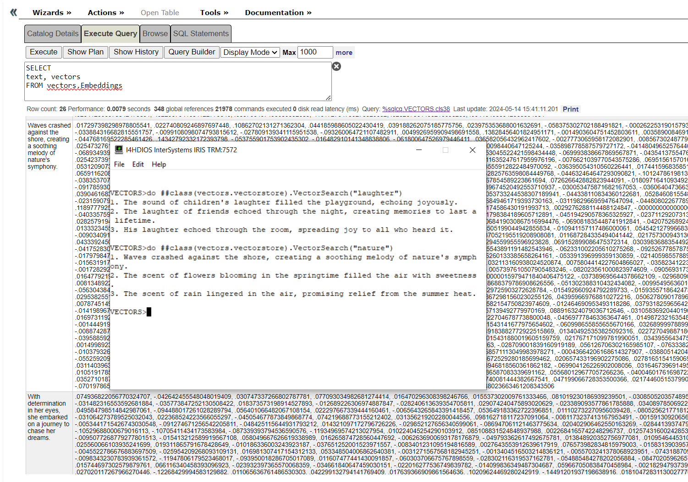

# Vector Search using IRIS

Prerequisites:
1. Python
2. InterSystems IRIS for Health - as it will be used as the vector database

Steps to follow:
1. Clone the repo.
2. Open VS Code, connect to desired instance and namespace of IRIS and compile the classes.
3. Open IRIS Terminal and invoke the command `do ##class(vectors.vectorstore).InsertEmbeddings()`, which reads the text from the file `text.txt` and generate embeddings and store them in IRIS.
4. Invoke the command `do ##class(vectors.vectorstore).VectorSearch("search_terms")` with desired words to perform similarity search.
IRIS will return top three closest match:

This demo was put together in May 2024.
